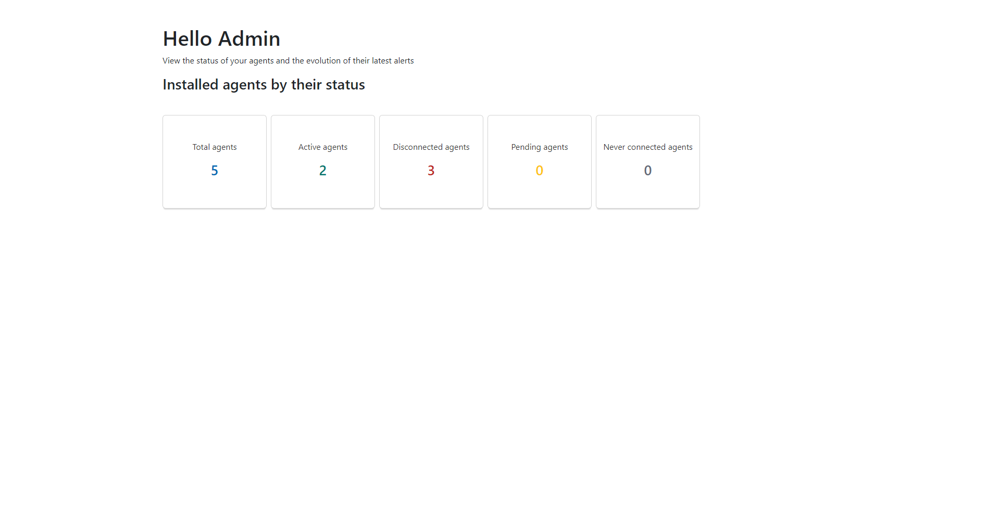

# Access Admin Dashboard - App

## React.js - react-bootstrap - custom css - react-hooks - axios

#### Styling components using react-bootstrap with custom CSS

#### Fetching data with axios

### Admin dashboard to display agents types & states

#### 1 - Clone this project

#### 2 - Run npm i && npm start

## If there is any issues please let me know

;
